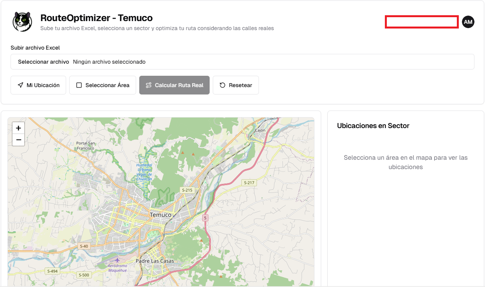
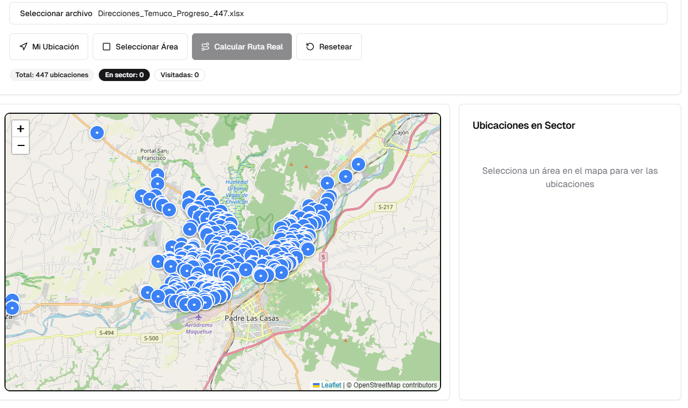
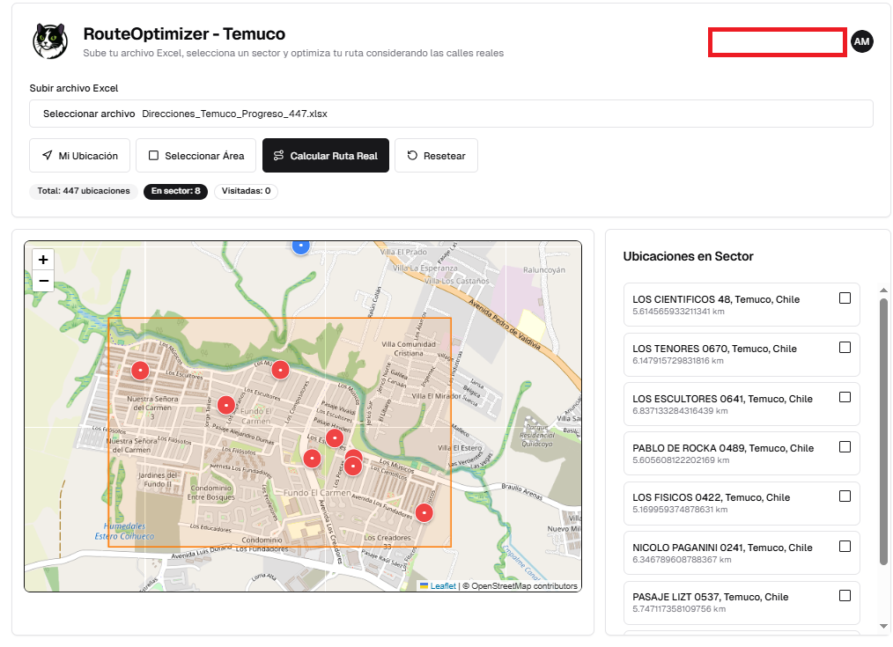
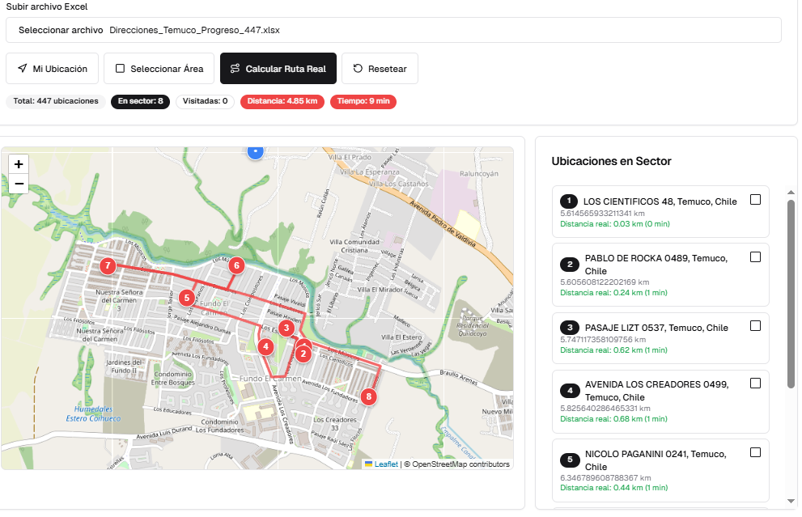
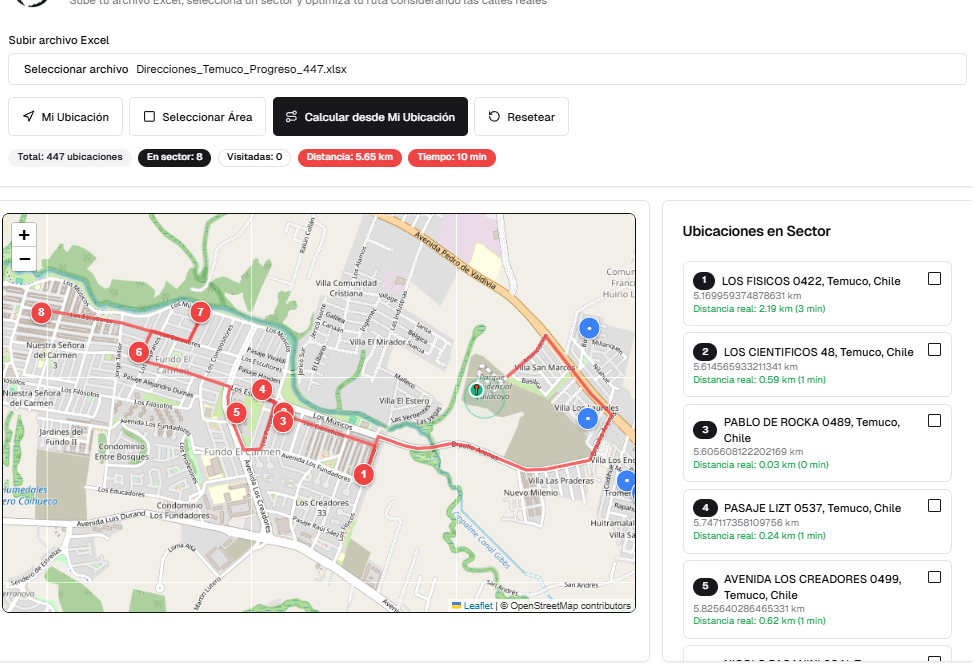
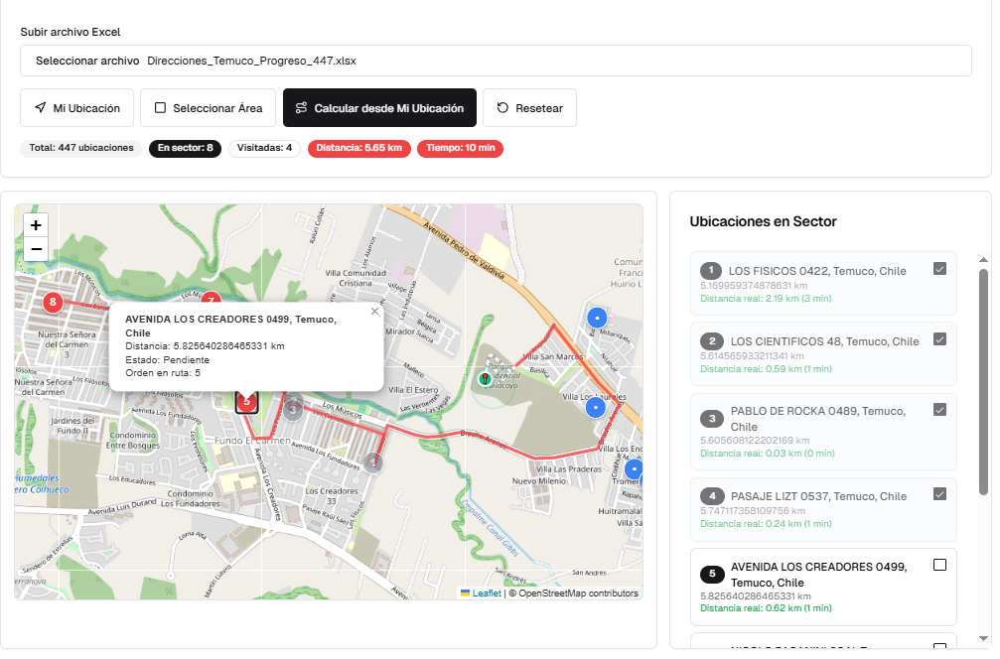

#  RouteOptimizer - Temuco

**RouteOptimizer** es una aplicación web que permite optimizar rutas de visitas en la ciudad de Temuco, Chile. Sube un archivo Excel con coordenadas geográficas, selecciona un área en el mapa y genera una ruta optimizada basada en calles reales.

---

## 🔐 Inicio de sesión

Para comenzar, el usuario debe iniciar sesión en la plataforma con sus credenciales.

---

## 🧰 Funcionalidades

### 📁 Subida de archivo Excel
Carga un archivo `.xlsx` que contenga las coordenadas de las ubicaciones. Se muestran automáticamente en el mapa como puntos geográficos.

> **Formato requerido**:
> El archivo debe contener al menos las siguientes columnas:
> - `Latitud`
> - `Longitud`

---

### 🗺️ Visualización de ubicaciones
Una vez cargado el archivo, se despliegan todas las ubicaciones en el mapa utilizando **Leaflet** y **OpenStreetMap**.

---

### 🔲 Selección de área
Permite seleccionar un sector dibujando un rectángulo en el mapa. Las ubicaciones dentro del área se listan en el panel lateral.

---

### 🧭 Cálculo de ruta real
Se calcula la ruta óptima entre los puntos seleccionados, considerando calles reales, distancia y tiempo estimado.

---

### 📍 Ruta desde Mi Ubicación
Puedes calcular la ruta partiendo desde tu ubicación actual, ideal para planificación en terreno.

---

### 📌 Detalles de cada punto
Puedes hacer clic en cada punto para ver detalles como distancia, orden en la ruta y estado de visita.

---

## 📂 Formato del archivo Excel

El archivo debe tener al menos las siguientes columnas:

| Latitud | Longitud |
|---------|----------|
| -38.735 | -72.590  |
| -38.741 | -72.615  |

---

## ⚙️ Tecnologías utilizadas

- **Frontend**: React + Leaflet.js
- **Backend**: Python + FastAPI (opcional)
- **Geocodificación**: No requerida (se trabaja directo con coordenadas)
- **Ruteo**: OpenRouteService o OSRM API

---

## 🚀 Mejoras futuras

- Exportar ruta a Google Maps
- Gestión de visitas realizadas
- Agrupamiento por zonas
- Versión móvil optimizada

---

## 🧑‍💻 Autor

Desarrollado por Carlos Ariel Monroy Oñate.
